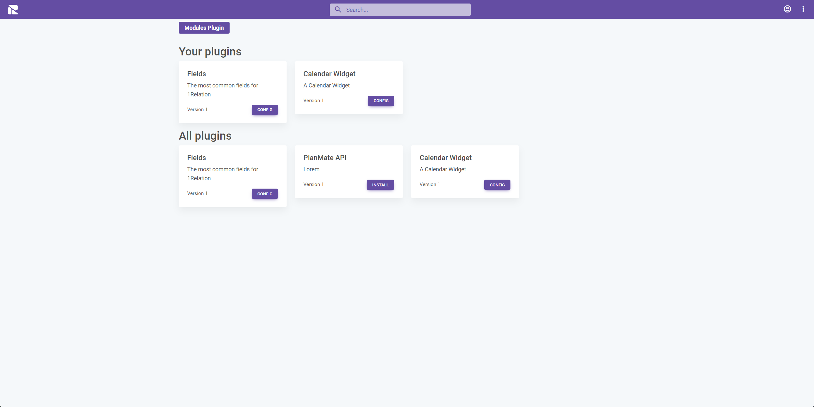
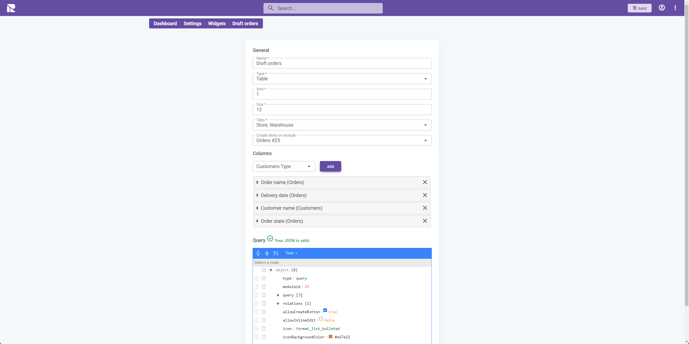

# Installing Apps

This guide provides step-by-step instructions on how to install and implement apps in the FlowAgent platform. It is intended for system designers and administrators responsible for configuring and customizing the FlowAgent environment.

## Installing an App

#### Step 1: Access Site Settings
- Navigate to the 'Site Settings' in your FlowAgent dashboard.

#### Step 2: Locate the Plugins Section
- Within Site Settings, find and select the 'Plugins' option.

#### Step 3: Search and Install the App
- Use the search function to find the app you need.
- Click the 'Install' button next to the app to initiate installation.

#### Step 4: Configure the App (If Necessary)
- Some apps require general configurations post-installation.
- If needed, click the 'Config' button next to the installed app in the plugin menu to access configuration settings.

## Implementing the App

### Implementing as a Settings Menu
- Certain apps will be automatically integrated into the site settings as a new menu option.
- Navigate to this menu to utilize the specific features of the installed app.

### Implementing as a Widget on Dashboards
- Apps that are designed as widgets can be added to main dashboards or item-specific dashboards.

#### Step 1: Accessing the Widget Menu
- On your chosen dashboard, locate and click on the 'Widget' menu.

#### Step 2: Create a New Widget
- Select the 'Create' option within the widget menu.

#### Step 3: Choose and Configure the App
- Pick the app you wish to add as a widget.
- Follow the on-screen instructions to populate the necessary information.
- Refer to the individual app's documentation for specific configuration details.

---

**Note**: Each app in FlowAgent may have unique features and configuration requirements. Always refer to the specific documentation provided for each app for detailed guidance. For further assistance, contact our support team.
